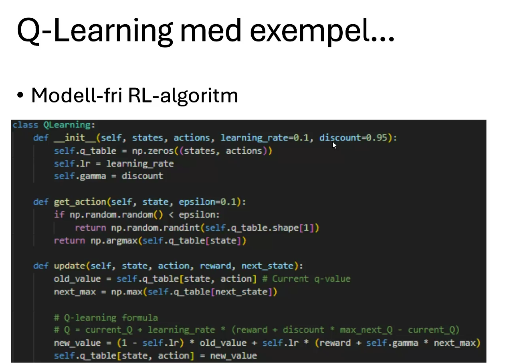

# Föreläsning vecka 6 - Reinforcement Learning

Förra veckan fokuserade vi på supervised learning, det vill säga scenarion där våra system lär sig från markerad/labeled data.
I supervised learning var vårt mål att hitta en matematisk modell som bäst kan hitta/passa en relation mellan input och output-värden.
Ju bättre modellen kan hitta relationer i datat, d.v.s hur olika faktorer påverkar varandra, desto bättre kan den bestämma vad ett givet input-värde ger för output.

* Tränar med labeled data
* Feedback genom loss functions

I reinforcement learning har vi ingen data att lära oss från, utan vi lär oss ett optimalt beteende/besluts-strategi genom att interagera med och få feedback från en miljö där vi kan utföra olika handlingar i olika tillstånd.
Vårt AI-program består i RL, av en s.k. "**learning agent**", som kan utföra ett antal **actions** och befinna sig i ett antal **states**.
I varje givet tillstånde/state, har agenten ett antal möjliga actions att välja mellan.
Agentens interaktion med sin miljö utgörs alltså av **en sekvens av states med tillhörande beslut av action**.

Varje sådant beslut har ett beräknat värde för belöning, d.v.s hur "bra" ett visst state-action-pair är.
Värdet av ett visst val av state+action, beräknas med en s.k. **value function**.

Genom sina interaktioner med miljön, bygger vårt program upp en **policy**.
Policyn är AI-agentens strategi för att beräkna/avgöra vilka actions som är bra i vilka situationer.

Det som karaktäriserar ett RL-system, är alltså hur du definierar agentens miljö, och hur du väljer att beräkna det uppskattade förväntade värdet av en viss action.

**RL**

* Ingen labeled träningsdata
* Inlärning genom interaktin med miljö
* (delayed) Feedback genom reward

**Enkelt exempel**
```python
# Conceptual example of RL components
class RLSystem:
    def __init__(self):
        self.state = None      # Current situation
        self.actions = []      # Possible actions
        self.rewards = 0       # Accumulated rewards
        self.policy = {}       # Action selection strategy
    
    def choose_action(self, state):
        return self.policy.get(state, random_action())
    
    def get_reward(self, state, action):
        return environment_feedback(state, action)
    
    def update_policy(self, state, action, reward):
        self.policy[state] = update_based_on_feedback(action, reward)

```

**RL Key components**

* Agentinteraktion
* States, Action, Rewards
* Policy: Agents strategi för att avgöra rätt actions
* Value function: Beräknar förväntat värde för ett (state, action)

**Q-Learning**

En typisk modell-fri RL-algoritm. Lär sig ett Quality-value för varje action i varje state.
Definieras som:

Q(state, action) = (1 - α) x Q(state, action) + α x (reward + γ x max(Q(next_state, all_actions)))

* **Q table/function**
* **alpha** - Learning rate, hur snabbt vi uppdaterar våra Q-värden
* **gamma** - discount, hur mycket vi värderar framtida rewards

Algoritmen:
Beräknar bästa action för ett givet state
Uppdaterar Q-tabellen som håller koll på värdet för olika state-action-par.

## RL-exempel - GridWorld

Vi vill skapa en AI som kan lära sig att navigera i en miljö bestående av ett rutsystem (grid).
Vi behöver...

```python
env = SimpleGridWorld()
agent = QLearning(states=16, actions=4)
episodes = 1000

for episode in range(episodes):
    state, _ = env.reset()
    done = False

    while not done:
        action: agent:get_action(state)
        next_state, reward, done, _, _ = env.step(action)
        agent.update(state, action, reward, next_state)
        state = next_state
```

**Miljön - SimpleGridWorld**

```python
import gymnasium as gym # Gymnsium, standard interface för att skapa RL-mijöer
import numpy as np

class SimpleGridWorld(gym.Env):
    def __init__(self):
        self.grid_size = 4
        self.state = 0  # Starting position
        self.goal = 15  # Bottom-right corner
        
        self.action_space = gym.spaces.Discrete(4)  # Up, Right, Down, Left
        self.observation_space = gym.spaces.Discrete(16)
        
    def step(self, action):
        # Current position
        row = self.state // self.grid_size
        col = self.state % self.grid_size
        
        # Move based on action
        if action == 0:  # Up
            row = max(0, row - 1)
        elif action == 1:  # Right
            col = min(self.grid_size - 1, col + 1)
        elif action == 2:  # Down
            row = min(self.grid_size - 1, row + 1)
        elif action == 3:  # Left
            col = max(0, col - 1)
            
        self.state = row * self.grid_size + col
        
        # Reward structure
        done = self.state == self.goal
        reward = 1.0 if done else -0.1
        
        return self.state, reward, done, False, {}
        
    def reset(self, seed=None):
        super().reset(seed=seed)
        self.state = 0
        return self.state, {}
```

**Learning agent - Q-algoritm**

```python
class QLearning:
    def __init__(self, states, actions, learning_rate=0.1, discount=0.95):
        self.q_table = np.zeros((states, actions))
        self.lr = learning_rate
        self.gamma = discount
        
    def get_action(self, state, epsilon=0.1):
        if np.random.random() < epsilon:
            return np.random.randint(self.q_table.shape[1])
        return np.argmax(self.q_table[state])
        
    def update(self, state, action, reward, next_state):
        old_value = self.q_table[state, action] # Current q-value
        next_max = np.max(self.q_table[next_state])
        
        # Q-learning formula
        # Q = current_Q + learning_rate * (reward + discount * max_next_Q - current_Q)
        new_value = (1 - self.lr) * old_value + self.lr * (reward + self.gamma * next_max)
        self.q_table[state, action] = new_value
```

## Vad mer kan vi göra här?

* Modifiera belönings-strukturen för att få fram olika beteenden
* Lägg till obstacles i miljön
* Implementera olika exploration strategies
* Visualisera inlärnings-processen
* Jämför prestanda med olika hyperparametrar

## RL i verkligheten

* Game AI (e.g. AlphaGo, OpenAI Five)
* Robotik-kontroller och navigering
* Resource management, optimering
* Trading-strategier
* Recommendations-system

## Vanliga utmaningar med RL

* Exploration vs. exploitation dilemma
* Reward function design
* State space representation
* Training stability
* Convergence issues


